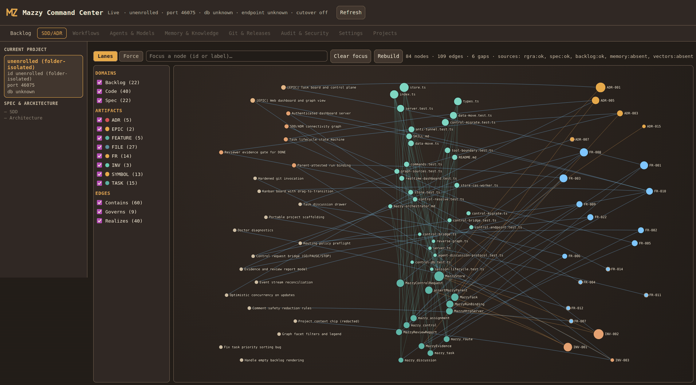
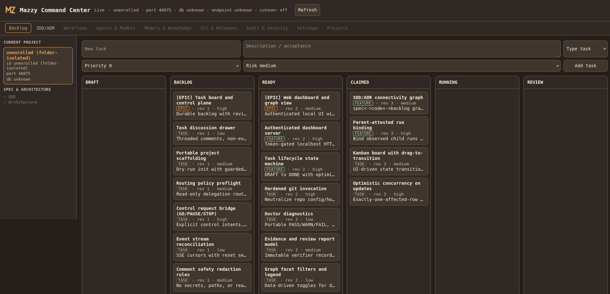

# Mazzy Command Center

**English** · [Русский](README.ru.md) · [Deutsch](README.de.md) · [中文](README.zh.md) · [日本語](README.ja.md) · [한국어](README.ko.md)

**A parent-attested, localhost task command center for the [Pi](https://www.npmjs.com/package/@earendil-works/pi-coding-agent) coding agent.**

_By **Mazurov N.N.** — https://github.com/mazurovn · Source-available under
**PolyForm Noncommercial 1.0.0**: free for personal, research, and educational use;
commercial use requires a separate license (see [LICENSE](LICENSE))._

Mazzy Command Center is a **full agent orchestrator and command center** built as a
project-local Pi extension. It turns a Pi session into a durable, auditable center
from which agent work is planned, delegated, executed, reviewed, and remembered — a
task tracker + orchestrator + its own sub-agent engine + a sub-agent creator +
meta-agents + tiered memory + a spec↔code↔backlog knowledge graph, all over one
embedded SQLite kernel.

> **Status: authenticated local pilot, actively building toward the full command
> center.** The pilot ships the durable kernel, the dashboard, the graph view, and
> parent-attested orchestration today. The own sub-agent engine, sub-agent creator,
> meta-agents, and tiered memory / DAG / RAG / vectors are the product direction and
> are landing incrementally. See [Roadmap](#roadmap) and [Security & limits](#security--limits).

---

## What it is

Mazzy is a **command center that owns orchestration**: it decides *what runs next,
with which agent, under which budget and capability ceiling*, and it keeps the
durable plan, evidence, memory, and knowledge graph. It is designed around a clean
**three-authority split** so that owning a powerful engine never turns the web
surface into a remote-execution oracle:

1. **Scheduling** (the kernel) — a pure planner computes what should run next from
   durable, typed records.
2. **Dispatch** (Mazzy's own executor) — a separate, network-less, parent-lifetime
   process is the only thing that actually launches work.
3. **Execution provider** — a replaceable runtime behind that executor (today
   `pi-subagents`; Mazzy owns the provider interface and is growing its own engine).

- **Durable task tracker** — epics / features / tasks / bugs with a revisioned
  lifecycle (`DRAFT → BACKLOG → READY → CLAIMED → RUNNING → REVIEW → DONE`, plus
  `BLOCKED / FAILED / CANCELLED`). Every update is optimistic-concurrency checked.
- **Orchestrator with attested dispatch** — Mazzy plans and dispatches work, binds
  the *observed* run to its task, and gates `DONE` on independent PASS evidence.
- **Own sub-agent engine & creator** *(direction)* — a first-party execution engine
  and a declarative sub-agent creator: define agents, capability ceilings, budgets,
  and prompt contracts, and spawn them through Mazzy's own executor.
- **Meta-agents** *(direction)* — agents whose output is *proposals* other agents
  act on, all under the same attested, capability-ceilinged dispatch path.
- **Tiered memory + knowledge** *(direction)* — hot / warm / cold memory with
  hybrid retrieval (RAG) and vector search, plus a plan DAG — as context, never as
  authority.
- **Authenticated local dashboard** — a self-contained web UI on `localhost` with a
  capability token, live SSE updates, a Kanban board, and a task discussion drawer.
- **SDD/ADR knowledge graph** — an in-browser visualization that links specification
  clauses (ADR/INV/FR), code components, and backlog items into one filterable
  connectivity graph, assembled from pluggable sources (memory & vectors plug in
  as first-class sources).
- **Safe scaffolding** — `mazzy-init` writes portable project templates with a
  dry-run default, guarded `--force`, and `--rollback`.

---

## Architecture at a glance

Mazzy owns orchestration through a **three-authority split** so a powerful engine
never turns the web surface into a remote-execution oracle:

```
Human / planner ── Pi commands / authenticated localhost browser ──┐
                                                                    v
Mazzy Command Center kernel (orchestration authority) ── SQLite kernel store
   • plan / evidence / memory & knowledge (direction)  │
   • issues single-use, integrity-checked dispatch      │
                                                        v
                        Mazzy executor  (separate, network-less process)
                                                        │
                                                        v
                        execution provider — pi-subagents today,
                        Mazzy's own engine (direction) — replaceable
```

**Core principles (invariants):**

- **No HTTP-caused execution** — no process that terminates an HTTP socket holds
  dispatch authority; only the separate executor launches work, and only against a
  single-use authorization.
- **No free text drives execution** — scheduling is a pure function of typed durable
  records; memory, vectors, and cache are *context, never authority*.
- **Parent-only writes** — kernel mutations require the interactive parent;
  inherited child processes are refused.
- **No host paths cross the API** — only opaque ids, enums, and relative refs leave
  the localhost HTTP boundary.
- **Comments are never evidence** — reviewer/verifier evidence is the authoritative
  PASS/FAIL channel.
- **All `git` invocations are hardened** — repository-supplied config/hooks and
  inherited environment cannot influence execution.

A deeper conceptual overview lives in [`docs/ARCHITECTURE.md`](docs/ARCHITECTURE.md).

---

## Tools and commands

**Parent-only tools** (the LLM-visible surface):

| Tool | Purpose |
|---|---|
| `mazzy_task` | Create / list / get / update durable tasks (revisioned; `DONE` needs PASS evidence). |
| `mazzy_route` | Read-only policy preflight for delegation (planning only; the executor dispatches). |
| `mazzy_assignment` | Parent-attested run binding, completion import, and reviewer evidence. |
| `mazzy_discussion` | Read/answer a durable task discussion. |
| `mazzy_control` | Claim/complete/fail dashboard GO / PAUSE / STOP requests. |

**Slash commands:** `/mazzy` (status + dashboard URL), `/mazzy-url` (access URL with
token), `/mazzy-server` (start/stop/status), `/mazzy-menu` (`Ctrl+Alt+M`),
`/mazzy-init`, `/mazzy-doctor`, `/mazzy-registry`, `/mazzy-clean`.

---

## Screenshots

**SDD/ADR connectivity graph** — specification (ADR/INV/FR), code, and backlog in one
filterable graph:



**Backlog board** — a Kanban board with a revisioned lifecycle:



---

## Installation

Mazzy Command Center is a **project-local Pi package**, installed into a project's
Pi configuration.

**Requirements**

| Component | Version |
|---|---|
| Node.js | `>= 22.19.0` |
| `@earendil-works/pi-coding-agent` | `0.84.2` (exact peer) |
| `@earendil-works/pi-ai` | `0.84.2` (exact peer) |
| `@earendil-works/pi-tui` | `0.84.2` (exact peer) |

**Install from npm** (recommended):

```bash
pi install npm:@mazurovn/mazzy-command-center
# then restart Pi so it discovers the extension.
```

**Install from GitHub:**

```bash
pi install git:github.com/mazurovn/Mazzy-Command-Center
```

**Install from a local checkout** (for development):

```bash
git clone https://github.com/mazurovn/Mazzy-Command-Center.git
cd Mazzy-Command-Center
npm install
pi install -l /path/to/Mazzy-Command-Center   # from your Pi project
```

**Verify**

```bash
npm run typecheck   # tsc, no emit
npm test            # node --test (requires a git-initialized working tree)
```

In a Pi session, run `/mazzy` to see status and the dashboard URL, or `/mazzy-url`
to reveal the authenticated access URL (the token is never written to logs).

---

## The web dashboard

Start it from Pi with `/mazzy-server start`, then open the URL from `/mazzy-url`.
The dashboard is a single self-contained page under a strict Content-Security
Policy (no external scripts). It provides:

- a **Backlog** Kanban board with drag-to-transition and a task discussion drawer;
- an **SDD/ADR** graph tab with domain/artifact/edge filters and node focus;
- a redacted project context chip (project id, session prefix, bound port) — never
  a host path.

Access is gated by a per-session capability token; the API rejects any request
without it and never embeds the token in the served HTML.

---

## Roadmap

Mazzy Command Center is being built into a full agent orchestrator. Shipped today:
the durable kernel, the task tracker, the authenticated dashboard, the SDD/ADR graph
view, and parent-attested orchestration. The product direction, landing
incrementally behind the three-authority model:

- **Own sub-agent engine** — a first-party execution engine behind Mazzy's own
  network-less executor (the provider interface exists today; `pi-subagents` is the
  first provider).
- **Sub-agent creator** — declaratively define agents, capability ceilings, budgets,
  and prompt contracts, then dispatch them through Mazzy.
- **Meta-agents** — agents whose output is proposals other agents act on, under the
  same attested, capability-ceilinged dispatch path.
- **Tiered memory + RAG + vectors** — hot / warm / cold memory and hybrid retrieval
  as first-class graph/retrieval sources (as context, never authority).
- **Plan DAG** — durable, declarative plan graphs the pure planner reads from.

---

## Security & limits

This is an **authenticated local pilot**, and the README should not be read as a
production security claim.

- One machine, one trusted user; process-level parent/child boundaries.
- Not multi-user authorization, not tenant isolation, not remote identity, not a
  distributed writer lease.
- Local dashboard authentication, parent-only writes, task revisions, bound runs,
  and reviewer evidence gating are pilot controls — a dashboard action, a comment,
  or a parent acknowledgement is **not** proof of execution or verification.

Report a security concern via a private channel rather than a public issue.

---

## Development

```bash
npm run typecheck
npm test
```

- Source: `src/` (TypeScript, run under Node's native type stripping — no build step).
- Web UI: `static/` (self-contained HTML + vendored assets).
- Skills / templates: `skills/`, `resources/`.
- Tests: `test/` (Node's built-in test runner).

See [`docs/`](docs/) for the conceptual architecture and specification summary.

---

## Author

**Mazurov N.N.** — https://github.com/mazurovn

## License

**Source-available under the [PolyForm Noncommercial License 1.0.0](LICENSE).**
Copyright (c) 2026 Mazurov N.N.

- ✅ **Free** to use, study, modify, and share for any **noncommercial** purpose —
  personal use, research and science, education, and evaluation.
- ⛔ **No commercial use.** Companies and commercial products/services need a
  separate commercial license. A **Mazzy Command Center Enterprise** edition is
  offered commercially.
- ⛔ You must keep all author/copyright/license notices, and may **not** rename the
  software, remove attribution, or present modified versions under the same name
  ("Mazzy Command Center" / "Mazzy") without written permission.

For a commercial license or any use beyond these terms, contact the author:
https://github.com/mazurovn
